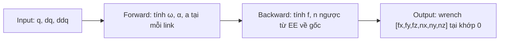

## Giải thích lớp `RecursiveNewtonEuler`

Đây là implementation của **thuật toán đệ quy Newton-Euler (RNEA)** — thuật toán kinh điển trong động lực học robot dùng để tính **lực và mô-men tương tác** tại các khớp. Trong trường hợp này, nó tính wrench (lực + mô-men) mà cánh tay robot tác dụng lên UAV tại khớp gốc (khớp 0).

---

### 1. Khởi tạo & hằng số

```python
GRAVITY = np.array([0.0, 0.0, -9.81])  # vector trọng lực
```
- Nhận danh sách `DHLink` — mỗi link chứa thông số DH (`alpha, a, d, theta`), khối lượng (`mass`), vị trí tâm khối (`com`), và tensor quán tính (`inertia`).

---

### 2. `dh_rotation` và `dh_transform`

Hai hàm phụ trợ xây dựng **ma trận xoay 3×3** và **ma trận biến đổi đồng nhất 4×4** theo quy ước Denavit-Hartenberg. Ma trận `R_i-1_i` biến đổi vector từ frame `i` sang frame `i-1`.

---

### 3. `compute_interaction_wrench` — Hàm chính

Gồm **2 pha đệ quy**:

#### Pha 1: Đệ quy thuận (Forward Recursion) — từ gốc → end-effector

Duyệt từ link 0 đến link n-1, tại mỗi link `i` tính:

| Đại lượng | Công thức | Ý nghĩa |
|---|---|---|
| **ω_i** | `R^T · ω_{i-1} + dq_i · ẑ` | Vận tốc góc của link i (trong frame i) |
| **α_i** | `R^T · α_{i-1} + ddq_i · ẑ + ω_i × (dq_i · ẑ)` | Gia tốc góc của link i |
| **a_i** | `R^T · a_{i-1} + α_i × p_i + ω_i × (ω_i × p_i)` | Gia tốc tuyến tính tại gốc frame i |
| **a_com_i** | `a_i + α_i × com_i + ω_i × (ω_i × com_i)` | Gia tốc tuyến tính tại **tâm khối** link i |

Trong đó:
- `R^T` = `R_i_i-1` (xoay ngược từ frame i-1 về frame i)
- `ẑ = [0, 0, 1]` = trục quay khớp revolute
- `p_i` = vector vị trí gốc frame i trong chính frame i (tính từ tham số DH)
- `com_i` = vị trí tâm khối so với gốc frame i

> **Lưu ý**: `base_acc = -GRAVITY = [0, 0, +9.81]` — đây là trick kinh điển: thay vì tính trọng lực riêng, ta giả lập bằng cách cho gốc robot có gia tốc "hướng lên" bằng g, hiệu ứng toán học tương đương.

---

#### Pha 2: Đệ quy lùi (Backward Recursion) — từ end-effector → gốc

Duyệt ngược từ link n-1 về link 0, tại mỗi link `i` tính:

| Đại lượng | Công thức | Ý nghĩa |
|---|---|---|
| **F_i** | `m_i · a_com_i` | Lực quán tính Newton tại tâm khối |
| **N_i** | `I_i · α_i + ω_i × (I_i · ω_i)` | Mô-men quán tính Euler (gồm cả hiệu ứng gyroscopic) |
| **f_i** | `R_{i+1} · f_{i+1} + F_i` | Tổng lực tại khớp i (lực từ link tiếp theo + lực quán tính) |
| **n_i** | `R_{i+1} · n_{i+1} + p_i × f_i + com_i × F_i + N_i` | Tổng mô-men tại khớp i |

- `f_{n} = 0`, `n_{n} = 0` (không có tải trọng ở end-effector)
- `R_{i+1}` biến đổi lực/mô-men từ frame i+1 về frame i

---

### 4. Kết quả trả về

```python
return np.concatenate([f_next, n_next])  # [fx, fy, fz, nx, ny, nz]
```

Sau khi đệ quy lùi kết thúc, `f_next` và `n_next` chính là **lực và mô-men tại khớp 0** — tức là wrench mà cánh tay robot tác dụng lên thân UAV. Vector 6 chiều này được dùng trong bộ điều khiển UAV để **bù trừ ảnh hưởng động lực học** của cánh tay.

---

### Tóm tắt luồng dữ liệu



Đây là thuật toán **O(n)** — rất hiệu quả so với phương pháp Lagrange (O(n³)), đặc biệt quan trọng khi chạy real-time trên hệ UAV-arm.

Viewed arm_dynamics_node.py:1-313

## Class [ArmDynamicsNode(Node)](cci:2://file:///home/wicom/ros2_ws/RBFNN-for-Backstepping-couple-dynamic-/scripts/arm_dynamics_node.py:208:0-299:40) — Giải thích chi tiết

[ArmDynamicsNode](cci:2://file:///home/wicom/ros2_ws/RBFNN-for-Backstepping-couple-dynamic-/scripts/arm_dynamics_node.py:208:0-299:40) là một **ROS2 Node** đóng vai trò **cầu nối giữa dữ liệu khớp cánh tay robot và thuật toán Newton-Euler**. Nó lắng nghe trạng thái khớp, tính toán lực/mô-men tương tác của cánh tay lên UAV, rồi publish kết quả ra topic để các node khác sử dụng.

---

### 1. Khởi tạo [__init__](cci:1://file:///home/wicom/ros2_ws/RBFNN-for-Backstepping-couple-dynamic-/scripts/arm_dynamics_node.py:210:4-260:82) (dòng 211–261)

#### a. Định nghĩa cánh tay 6-DoF (dòng 216–235)
```python
links = [
    DHLink(alpha= 0.0,      a=0.0,   d=0.089, mass=3.7, ...),
    DHLink(alpha= np.pi/2,  a=0.0,   d=0.0,   mass=8.4, ...),
    # ... 6 link tổng cộng
]
```
- Tạo danh sách **6 link** với tham số DH (kiểu UR5-like).
- Mỗi link có: `alpha`, `a`, `d` (tham số hình học DH), `mass`, [com](cci:1://file:///home/wicom/ros2_ws/RBFNN-for-Backstepping-couple-dynamic-/scripts/arm_dynamics_node.py:86:4-202:47) (trọng tâm), `inertia` (tensor quán tính).

#### b. Tạo bộ tính toán RNE (dòng 237)
```python
self.rne = RecursiveNewtonEuler(links)
```
- Khởi tạo đối tượng [RecursiveNewtonEuler](cci:2://file:///home/wicom/ros2_ws/RBFNN-for-Backstepping-couple-dynamic-/scripts/arm_dynamics_node.py:52:0-202:47) với 6 link đã định nghĩa.

#### c. Khởi tạo trạng thái khớp (dòng 240–244)
```python
self.q   = np.zeros(6)    # Góc khớp hiện tại
self.dq  = np.zeros(6)    # Vận tốc góc khớp
self.ddq = np.zeros(6)    # Gia tốc góc khớp
self._prev_dq   = np.zeros(6)  # Vận tốc trước đó (để tính ddq)
self._prev_time = None          # Thời gian trước đó
```

#### d. Publisher (dòng 247–251)
```python
self.wrench_pub = self.create_publisher(
    WrenchStamped, '/arm/interaction_wrench', 10)
```
- Publish kết quả **wrench (lực + mô-men)** ra topic `/arm/interaction_wrench`.
- Node C++ (RBFNN controller) sẽ subscribe topic này để so sánh với output RBFNN → **giám sát chất lượng học thích nghi**.

#### e. Subscriber (dòng 254–259)
```python
self.joint_sub = self.create_subscription(
    JointState, '/joint_states', self.joint_callback, 10)
```
- Lắng nghe trạng thái khớp từ topic `/joint_states` (do Gazebo hoặc driver publish).

---

### 2. Callback [joint_callback](cci:1://file:///home/wicom/ros2_ws/RBFNN-for-Backstepping-couple-dynamic-/scripts/arm_dynamics_node.py:262:4-299:40) (dòng 263–300)

Mỗi khi nhận được message `JointState`, hàm này thực hiện **3 bước**:

#### Bước 1: Cập nhật `q`, `dq`, `ddq` (dòng 264–286)

```
msg.position → self.q     (góc khớp)
msg.velocity → self.dq    (vận tốc, nếu có)
                           (nếu không có → tính bằng sai phân: dq = Δq / Δt)
self.ddq = (dq_hiện_tại - dq_trước_đó) / Δt    (gia tốc bằng sai phân)
```

| Biến | Ý nghĩa | Cách cập nhật |
|------|---------|---------------|
| `q` | Góc khớp | Trực tiếp từ `msg.position` |
| `dq` | Vận tốc khớp | Từ `msg.velocity` hoặc sai phân `Δq/Δt` |
| `ddq` | Gia tốc khớp | Luôn bằng sai phân `Δdq/Δt` |

#### Bước 2: Tính wrench tương tác (dòng 289)
```python
wrench = self.rne.compute_interaction_wrench(self.q, self.dq, self.ddq)
```
- Gọi thuật toán **Newton-Euler đệ quy** → trả về `[fx, fy, fz, nx, ny, nz]` tại khớp 0 (điểm gắn cánh tay vào UAV).

#### Bước 3: Publish kết quả (dòng 291–300)
```python
msg_out = WrenchStamped()
msg_out.wrench.force.x  = wrench[0]   # Lực theo x
msg_out.wrench.force.y  = wrench[1]   # Lực theo y
msg_out.wrench.force.z  = wrench[2]   # Lực theo z
msg_out.wrench.torque.x = wrench[3]   # Mô-men theo x
msg_out.wrench.torque.y = wrench[4]   # Mô-men theo y
msg_out.wrench.torque.z = wrench[5]   # Mô-men theo z
self.wrench_pub.publish(msg_out)
```

---

### 3. Luồng dữ liệu tổng thể

```
Gazebo/Driver                  ArmDynamicsNode               RBFNN Controller (C++)
      │                              │                              │
      │── /joint_states ──────▶│                              │
      │                              │  1. Cập nhật q, dq, ddq      │
      │                              │  2. Chạy RNE → wrench        │
      │                              │                              │
      │                              │── /arm/interaction_wrench ──▶│
      │                              │                  (so sánh với RBFNN output)
```

### Tóm tắt

| Thành phần | Vai trò |
|-----------|---------|
| **[ArmDynamicsNode](cci:2://file:///home/wicom/ros2_ws/RBFNN-for-Backstepping-couple-dynamic-/scripts/arm_dynamics_node.py:208:0-299:40)** | Node ROS2 tính động lực học cánh tay theo mô hình vật lý |
| **Input** | `/joint_states` — góc, vận tốc các khớp |
| **Output** | `/arm/interaction_wrench` — lực & mô-men cánh tay tác dụng lên UAV |
| **Mục đích** | Cung cấp **ground truth** (giá trị tham chiếu) để so sánh với RBFNN, giám sát chất lượng bộ điều khiển thích nghi |