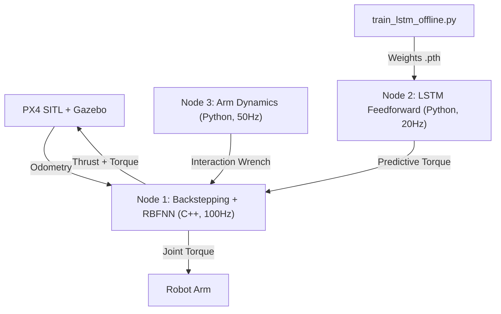
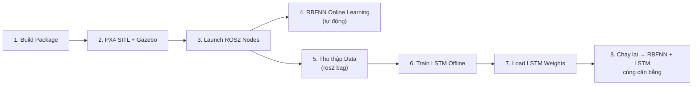

# Hướng Dẫn Chạy Mô Phỏng & Huấn Luyện RBFNN + LSTM

Tài liệu này hướng dẫn chi tiết **từng bước** để chạy mô phỏng và thực hiện bước đầu quá trình huấn luyện cân bằng động cho hệ thống UAM (UAV + Cánh tay robot 6DoF) sử dụng **RBFNN** (online) và **LSTM** (offline → online inference).

---

## Tổng Quan Hệ Thống



| Node | File | Chức năng | Tần số |
|------|------|-----------|--------|
| Backstepping + RBFNN | [uam_backstepping_rbfnn_node.cpp](file:///home/wicom/ros2_ws/RBFNN-for-Backstepping-couple-dynamic-/src/uam_backstepping_rbfnn_node.cpp) | Điều khiển thích nghi, RBFNN learns online | 100 Hz |
| LSTM Feedforward | [lstm_feedforward_node.py](file:///home/wicom/ros2_ws/RBFNN-for-Backstepping-couple-dynamic-/scripts/lstm_feedforward_node.py) | Dự báo mô-men nhiễu từ trajectory plan | 20 Hz |
| Arm Dynamics | [arm_dynamics_node.py](file:///home/wicom/ros2_ws/RBFNN-for-Backstepping-couple-dynamic-/scripts/arm_dynamics_node.py) | Tính interaction wrench (Newton-Euler) | 50 Hz |

---

## Bước 1: Chuẩn Bị Môi Trường

### 1.1 Kiểm tra phụ thuộc

```bash
# Kiểm tra ROS2 đã source
echo $ROS_DISTRO     # Phải ra: humble hoặc iron

# Kiểm tra PX4 SITL
ls ~/PX4-Autopilot/build/px4_sitl_default/bin/px4

# Kiểm tra Python dependencies
python3 -c "import torch; print(torch.__version__)"
python3 -c "import pandas; import matplotlib; print('OK')"
```

### 1.2 Cài đặt thiếu (nếu cần)

```bash
# PyTorch (CPU, phù hợp Raspberry Pi và PC)
pip3 install torch --index-url https://download.pytorch.org/whl/cpu

# Pandas + Matplotlib cho training script
pip3 install pandas matplotlib

# Micro XRCE-DDS Agent
sudo apt install ros-${ROS_DISTRO}-micro-xrce-dds-agent
```

---

## Bước 2: Build ROS2 Package

```bash
# Source ROS2
source /opt/ros/${ROS_DISTRO}/setup.bash

# Build package
cd ~/ros2_ws
colcon build --packages-select uam_controller --symlink-install

# Source workspace
source install/setup.bash
```
---

## Bước 3: Khởi Động PX4 SITL + Gazebo

### Terminal 1 — PX4 SITL

```bash
cd ~/PX4-Autopilot
make px4_sitl gz_x500
```

Chờ cho đến khi thấy dòng:
```
INFO  [commander] Ready for takeoff!
```

> [!NOTE]
> `gz_x500` sẽ tự khởi chạy Gazebo với mô hình x500 drone. Nếu đã cấu hình model UAV + robot arm riêng, thay bằng lệnh tương ứng.

---

## Bước 4: Khởi Động Hệ Thống ROS2

### Terminal 2 — Launch toàn bộ hệ thống

```bash
# Source workspace
source ~/ros2_ws/install/setup.bash

# Chạy ở chế độ simulation
ros2 launch uam_controller uam_system.launch.py sim:=true
```

Hệ thống sẽ khởi động 3 node theo thứ tự:
1. **t=0s** — Micro XRCE-DDS Agent (cầu nối PX4 ↔ ROS2 qua UDP 8888)
2. **t=2s** — Backstepping + RBFNN controller
3. **t=2.5s** — Arm Dynamics (Newton-Euler)
4. **t=3s** — LSTM Feedforward

### Kiểm tra các node đã chạy

```bash
# Terminal 3
source ~/ros2_ws/install/setup.bash
ros2 node list
```

Expected output:
```
/uam_adaptive_controller
/lstm_predictive_node
/arm_dynamics_node
```

### Kiểm tra topics

```bash
ros2 topic list | grep -E "uam|arm|lstm|fmu"
```

Expected:
```
/ai/lstm_predictive_torque
/arm/interaction_wrench
/uam/debug_state
/uam/joint_torque_cmd
/fmu/in/offboard_control_mode
/fmu/in/vehicle_thrust_setpoint
/fmu/in/vehicle_torque_setpoint
/fmu/out/vehicle_odometry
```

---

## Bước 5: Quan Sát RBFNN Học Online

RBFNN **tự động học online** ngay khi hệ thống chạy. Để giám sát:

### 5.1 Xem debug state realtime

```bash
# Terminal 3 — Xem toàn bộ trạng thái
ros2 topic echo /uam/debug_state
```

Giải mã output `data[]`:

| Index | Ý nghĩa | Giải thích |
|-------|----------|------------|
| 0-2 | `px, py, pz` | Vị trí UAV |
| 3-5 | `φ, θ, ψ` | Góc Euler |
| 6-8 | `e7, e9, e11` | Sai số tư thế (Roll, Pitch, Yaw) |
| 9-11 | `e8, e10, e12` | Sai số vận tốc tư thế |
| 12 | `e5` | Sai số độ cao |
| 13 | `m̂` | Khối lượng ước lượng thích nghi |
| 14-16 | `n̂₀x, n̂₀y, n̂₀z` | **Nhiễu ước lượng từ RBFNN** ← Quan sát giá trị này |
| 17-19 | `gx, gy, gz` | Mô-men trọng lực do dịch trọng tâm |
| 20 | `U1` | Thrust (lực đẩy) |
| 21-23 | `U2, U3, U4` | Torque (Roll, Pitch, Yaw) |
| 24-29 | `τ₁..τ₆` | Mô-men lệnh cho 6 khớp tay |

### 5.2 Xem interaction wrench từ Arm Dynamics

```bash
ros2 topic echo /arm/interaction_wrench
```

### 5.3 Xem LSTM predictive output

```bash
ros2 topic echo /ai/lstm_predictive_torque
```

> [!TIP]
> Ban đầu LSTM sẽ xuất giá trị gần 0 (trọng số ngẫu nhiên). Đây là bình thường — cần thu thập dữ liệu rồi huấn luyện offline trước.

---

## Bước 6: Thu Thập Dữ Liệu Cho LSTM Training

### 6.1 Ghi dữ liệu bằng ros2 bag

Trong khi hệ thống đang chạy, mở terminal mới:

```bash
# Terminal 4 — Thu thập dữ liệu
source ~/ros2_ws/install/setup.bash
mkdir -p ~/ros2_ws/data

ros2 bag record \
  /joint_states \
  /arm/interaction_wrench \
  /fmu/out/vehicle_odometry \
  /uam/debug_state \
  -o ~/ros2_ws/data/training_bag_01
```

### 6.2 Tạo kịch bản di chuyển cánh tay

Để thu được dữ liệu phong phú, cần cho cánh tay robot di chuyển với các pattern khác nhau. Publish joint trajectory commands:

```bash
# Ví dụ: di chuyển khớp 1 và 2
ros2 topic pub /arm_controller/joint_trajectory_plan \
  sensor_msgs/msg/JointState \
  "{position: [0.5, -0.3, 0.2, 0.0, 0.1, 0.0]}" \
  --rate 10
```

> [!IMPORTANT]
> Thu thập **ít nhất 5-10 phút** dữ liệu với nhiều pattern di chuyển khác nhau (sin wave, step, random) để LSTM học tốt.

### 6.3 Dừng thu thập

Nhấn `Ctrl+C` trong Terminal 4 để dừng `ros2 bag record`.

### 6.4 Chuyển đổi bag → CSV

Tạo script chuyển đổi (hoặc dùng dữ liệu tổng hợp):

```bash
# Tùy chọn A: Dùng dữ liệu tổng hợp (synthetic) để thử nghiệm nhanh
# Script train_lstm_offline.py tự tạo nếu không tìm thấy CSV
cd ~/ros2_ws/RBFNN-for-Backstepping-couple-dynamic-/scripts

# Tùy chọn B: Chuyển bag → CSV (nếu đã thu thập từ simulation)
# Cần viết script riêng dùng rclpy để parse bag file
```

---

## Bước 7: Huấn Luyện LSTM Offline

### 7.1 Với dữ liệu tổng hợp (nhanh, thử nghiệm đầu tiên)

```bash
cd ~/ros2_ws/RBFNN-for-Backstepping-couple-dynamic-/scripts

python3 train_lstm_offline.py \
  --epochs 100 \
  --batch_size 64 \
  --lr 0.001 \
  --seq_len 10 \
  --hidden_dim 64 \
  --synthetic_samples 80000 \
  --model_out ../models/lstm_uam_weights.pth
```

### 7.2 Với dữ liệu thực (từ Gazebo simulation)

```bash
python3 train_lstm_offline.py \
  --data_path ~/ros2_ws/data/gazebo_dataset.csv \
  --epochs 200 \
  --batch_size 64 \
  --lr 0.001 \
  --seq_len 10 \
  --model_out ../models/lstm_uam_weights.pth
```

### 7.3 Đọc kết quả

Sau khi huấn luyện xong, script sẽ in:
```
=== Kết quả Test ===
MSE  : 0.00xxxx
RMSE : 0.0xxx
Model đã lưu: ../models/lstm_uam_weights.pth
Đồ thị lưu tại: ../models/lstm_uam_weights_training_curve.png
```

> [!TIP]
> - **MSE < 0.01** là kết quả tốt cho lần train đầu tiên
> - Xem đồ thị tại `models/lstm_uam_weights_training_curve.png` để kiểm tra learning curve
> - Nếu val loss tăng (overfitting), giảm `--epochs` hoặc tăng `--dropout 0.2`

---

## Bước 8: Chạy Lại Với Trọng Số LSTM Mới

Sau khi huấn luyện xong, khởi động lại hệ thống:

```bash
# Dừng hệ thống cũ (Ctrl+C)
# Build lại (vì model file thay đổi)
cd ~/ros2_ws
colcon build --packages-select uam_controller --symlink-install
source install/setup.bash

# Chạy lại
ros2 launch uam_controller uam_system.launch.py sim:=true
```

Hoặc chỉ định file model khác:
```bash
ros2 launch uam_controller uam_system.launch.py \
  sim:=true \
  model_path:=/home/wicom/ros2_ws/RBFNN-for-Backstepping-couple-dynamic-/models/lstm_uam_weights.pth
```

---

## Bước 9: Kiểm Tra Hiệu Quả

### 9.1 So sánh RBFNN vs Ground Truth

```bash
# Xem RBFNN output (n̂₀)
ros2 topic echo /uam/debug_state --field data --once

# Xem Newton-Euler ground truth
ros2 topic echo /arm/interaction_wrench
```

Quan sát: **n̂₀ (index 14-16)** phải dần tiến gần lực/mô-men từ `/arm/interaction_wrench`

### 9.2 Xem LSTM prediction

```bash
ros2 topic echo /ai/lstm_predictive_torque
```

Sau khi train, giá trị LSTM không còn gần 0 mà phản ánh dự đoán torque.

### 9.3 Giám sát ổn định

```bash
# Quan sát sai số phải giảm dần
ros2 topic echo /uam/debug_state --field data --once
# → Kiểm tra e5 (index 12), e7,e9,e11 (index 6-8) → nên tiến về 0
```

---

## Tóm Tắt Quy Trình



> [!IMPORTANT]
> **RBFNN** học online tự động — không cần train riêng. Chỉ cần chạy hệ thống.
> **LSTM** cần train offline trước rồi mới load weights để dự báo chính xác.
> Cả hai kết hợp: LSTM dự báo trước + RBFNN bù phần dư còn lại.
